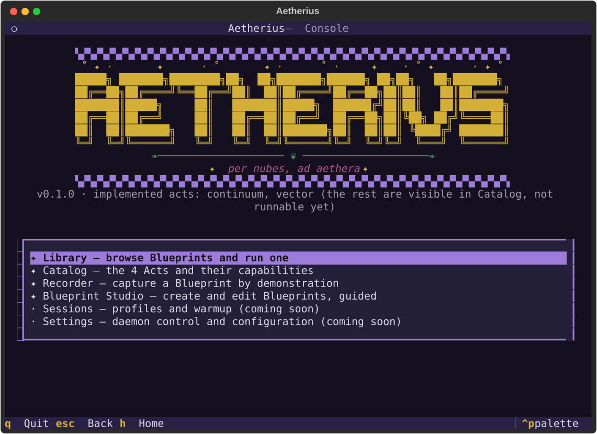
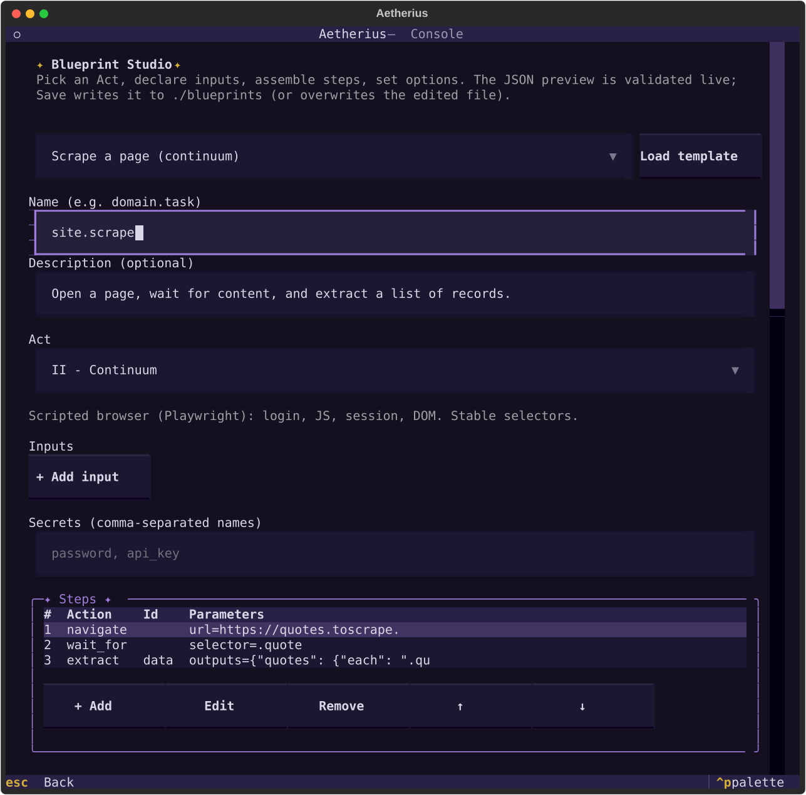

# Aetherius

```text
▚▞▚▞▚▞▚▞▚▞▚▞▚▞▚▞▚▞▚▞▚▞▚▞▚▞▚▞▚▞▚▞▚▞▚▞▚▞▚▞▚▞▚▞▚▞▚▞▚▞▚▞▚▞▚▞▚▞▚▞▚▞▚▞▚▞▚▞▚
 ˚ ✦ ·       ✦      · ˚       ✦ ·      ˚ ·     ✦    · ˚ ✦      · ✦ ˚
 █████╗ ███████╗████████╗██╗  ██╗███████╗██████╗ ██╗██╗   ██╗███████╗
██╔══██╗██╔════╝╚══██╔══╝██║  ██║██╔════╝██╔══██╗██║██║   ██║██╔════╝
███████║█████╗     ██║   ███████║█████╗  ██████╔╝██║██║   ██║███████╗
██╔══██║██╔══╝     ██║   ██╔══██║██╔══╝  ██╔══██╗██║╚██╗ ██╔╝╚════██║
██║  ██║███████╗   ██║   ██║  ██║███████╗██║  ██║██║ ╚████╔╝ ███████║
╚═╝  ╚═╝╚══════╝   ╚═╝   ╚═╝  ╚═╝╚══════╝╚═╝  ╚═╝╚═╝  ╚═══╝  ╚══════╝
            ❧──────────────────── ❦ ────────────────────❧
                     ✦  per nubes, ad aethera  ✦
▚▞▚▞▚▞▚▞▚▞▚▞▚▞▚▞▚▞▚▞▚▞▚▞▚▞▚▞▚▞▚▞▚▞▚▞▚▞▚▞▚▞▚▞▚▞▚▞▚▞▚▞▚▞▚▞▚▞▚▞▚▞▚▞▚▞▚▞▚
```

> Se veut le produit du concept de bot web modulaire, poussé à son paroxysme.   
> Capable de réaliser, sur la base d'un simple fichier d'instructions, n'importe quelle tâche.

## La vision

Dans la plupart des projets on réécrit le même code fragile : requêtes `axios`/HTTP, scraping,
automatisation de navigateur. C'est répétitif, fastidieux, et ça casse dès que le site ou l'API
change — il faut alors éditer ce code éparpillé dans chaque projet.

**Aetherius inverse le problème.** Le moteur du bot est fixe et robuste. Le comportement, lui, est
décrit dans un **fichier d'instructions déclaratif** (un *Blueprint*, en JSON). Quand un site
change, on corrige **un Blueprint**, pas N codebases. Et parce que le moteur est exposé via un
**daemon local**, on le pilote depuis **n'importe quel langage** (TypeScript, Python, …) avec le
même fichier d'instructions.

Aetherius est conçu pour être **exporté comme bibliothèque** et alimenter tous les projets :
récupérer un emploi du temps via API, scraper une page derrière un login, publier une vidéo en
restant indétectable, ou lâcher un agent autonome sur une tâche non scriptée.

Aetherius est à la fois une **bibliothèque** (consommée en direct ou via un daemon par les apps clientes)
et un **outil** : une **Console dans le terminal** pour créer, tester et gérer tout ça sans écrire
une ligne de JSON à la main.

<p align="center"><sub>▚▞▚ ✦ ▞▚▞</sub></p>

## Le concept : 4 Acts

Aetherius est un interprète qui joue en quatre **Acts**, du plus léger au plus puissant. Le
Blueprint choisit l'Act adapté à la tâche.

| Act | Nom | Moteur | Quand l'utiliser |
|-----|-----|--------|------------------|
| **I** | **Vector** | Requêtes HTTP/API | Les données sont derrière une API ou des endpoints stables. Le cas « axios ». Le plus rapide. |
| **II** | **Continuum** | Navigateur scripté (Playwright) | Il faut un vrai navigateur : login, JS, session, DOM. Sélecteurs connus et stables. |
| **III** | **Oracle** | Navigateur guidé par vision + discrétion | L'UI est fragile/obfusquée : Aetherius « voit » l'écran via un modèle vision-langage (grounding VLM) et agit avec discrétion. |
| **IV** | **Phantom** | Agent autonome | Objectif non scripté. Perçoit, raisonne, agit en boucle. Résilience maximale. Le plus lourd. |

Plus l'Act est élevé, plus le Blueprint est **haut-niveau** (on décrit *quoi*, plus *comment*) et
plus les dépendances sont lourdes (installées à la demande via des *extras*).

### Act I — Vector
Client HTTP robuste : requêtes GET/POST, encodage form/JSON, en-têtes, retries avec backoff,
pagination, stratégies d'authentification (cookie, bearer, basic, form-login type CAS), extraction
déclarative (JSONPath pour le JSON, CSS/XPath pour le HTML). Remplace les services `axios` écrits à
la main ; les constantes magiques disséminées deviennent des `inputs` typés et documentés.

### Act II — Continuum
Automatisation d'un vrai navigateur (Playwright) qui suit le Blueprint à la lettre : navigation,
remplissage, clics, attentes, extraction DOM, bridge JavaScript injecté. Gère les scénarios qui
exigent un navigateur : login, cookies de session, contenu rendu par JS. C'est l'équivalent propre
et réutilisable d'une « WebView cachée qui scrape ». Discrétion optionnelle.

### Act III — Oracle
Quand les sélecteurs sont trop fragiles ou absents, Oracle **regarde l'écran**. Un modèle
vision-langage (VLM — Claude par défaut, un détecteur local reste une option) localise en langage
naturel les éléments cibles sur des captures d'écran ; Aetherius clique par coordonnées à travers la
couche de discrétion. Le flux reste scripté et déterministe (un appel de grounding par cible). Idéal
pour les interfaces qui changent souvent ou piègent les bots.

### Act IV — Phantom
Un agent décisionnel autonome. Boucle **percevoir → raisonner → agir** : il perçoit la page (vision
+ DOM + arbre d'accessibilité), un planner (par défaut Claude, ex. `claude-fable-5` /
`claude-opus-4-8`, remplaçable par un VLM local) décide de l'action suivante, et l'action est jouée
via la couche de discrétion. Pour les objectifs non scriptés et la résilience maximale.

> Aetherius est destiné à l'automatisation **autorisée** : ses propres comptes, ses propres données,
> ses propres workflows.

<p align="center"><sub>▚▞▚ ✦ ▞▚▞</sub></p>

## Les fichiers d'instructions : les Blueprints

Un Blueprint est un fichier JSON déclaratif et versionné. Enveloppe :

```json
{
  "aetherius": "1.0",
  "name": "domaine.tache",
  "act": "vector",
  "inputs":  { "param": { "type": "string", "required": true } },
  "secrets": ["cle_injectee_au_runtime"],
  "vars":    { "domain": "https://exemple.fr" },
  "options": {
    "debug": false,
    "stealth": "off",
    "session": { "profile": "mon-profil", "persist": true },
    "timeout_ms": 30000,
    "retries": { "max": 3, "backoff": "exponential" }
  },
  "steps":   [ /* la séquence d'actions */ ],
  "outputs": { "resultat": "{{ steps.x.champ }}" }
}
```

- **inputs** : paramètres typés (le Blueprint est réutilisable, pas figé sur une valeur).
- **secrets** : identifiants/token fournis au runtime, **jamais** écrits dans le fichier (résolus
  depuis l'environnement / un `.env` local — voir [docs/secrets.md](docs/secrets.md)).
- **vars** : constantes locales (domaines, chemins).
- **options** : `debug`, `stealth`, `session`, `timeout_ms`, `retries`.
- **steps** : le *dictionnaire d'actions* (navigate, click, fill, type, http.request, extract,
  wait, if, for_each, …). Chaque Act déclare quelles actions il supporte ; un Blueprint qui demande
  une action non supportée par son Act échoue à la validation, avec un message clair.
- **outputs** : la forme des données retournées, via interpolation `{{ }}`.

Le format est défini une fois pour toutes dans [`contracts/blueprint.schema.json`](contracts/blueprint.schema.json).
Des exemples exécutables (dérivés de vrais projets) sont dans [`examples/`](examples/).

### Exemple — Act I (Vector) : emploi du temps par API
Voir [`examples/vector/ukit-planning-week.blueprint.json`](examples/vector/ukit-planning-week.blueprint.json).

```json
{
  "aetherius": "1.0",
  "name": "ukit.planning.week",
  "act": "vector",
  "inputs": {
    "group":  { "type": "string", "required": true },
    "monday": { "type": "string", "format": "date", "required": true }
  },
  "vars": { "domain": "https://ade-web.exemple.fr" },
  "steps": [
    {
      "id": "week",
      "action": "http.request",
      "method": "POST",
      "url": "{{ vars.domain }}/calendar/data",
      "headers": {
        "Content-Type": "application/x-www-form-urlencoded; charset=UTF-8",
        "Accept": "application/json"
      },
      "form": {
        "start": "{{ inputs.monday }}",
        "end": "{{ inputs.monday | add_days(7) }}",
        "resType": "103",
        "calView": "agendaWeek",
        "federationIds[]": "{{ inputs.group }}",
        "colourScheme": "3"
      },
      "expect": { "status": 200 },
      "extract": {
        "events": {
          "from": "json", "path": "$[*]",
          "where": "item.eventCategory != 'Vacances'",
          "fields": {
            "id": "$.id", "start": "$.start", "end": "$.end",
            "category": "$.eventCategory", "color": "$.backgroundColor",
            "description": "$.description"
          }
        }
      }
    }
  ],
  "outputs": { "events": "{{ steps.week.events }}" }
}
```
Les constantes autrefois codées en dur (`resType`, `colourScheme`) sont explicites, le filtrage
`Vacances` et le parsing sont déclaratifs, et le groupe/la date sont des `inputs` réutilisables.

### Exemple — Act II (Continuum) : login CAS + scraping
Voir [`examples/continuum/ukit-scolarite-login.blueprint.json`](examples/continuum/ukit-scolarite-login.blueprint.json).

```json
{
  "aetherius": "1.0",
  "name": "ukit.scolarite.cold",
  "act": "continuum",
  "secrets": ["cas_user", "cas_pass"],
  "options": { "session": { "profile": "scolarite", "persist": true }, "debug": false },
  "steps": [
    { "action": "navigate",  "url": "https://cas.exemple.fr/login" },
    { "action": "fill",      "selector": "#username", "value": "{{ secrets.cas_user }}" },
    { "action": "fill",      "selector": "#password", "value": "{{ secrets.cas_pass }}" },
    { "action": "click",     "selector": "input[name=submit]" },
    { "action": "wait_for",  "selector": ".ent-dashboard", "timeout_ms": 15000,
      "on_timeout": "fail:LOGIN_FAILED" },
    { "action": "emit",      "event": "LOGIN_SUCCESS" },
    { "action": "navigate",  "url": "https://ent.exemple.fr/dossier" },
    { "action": "extract",   "outputs": {
        "firstName":     { "selector": ".identity .firstname", "as": "text" },
        "studentNumber": { "selector": "#num-etudiant", "as": "text" },
        "ine":           { "selector": "#ine", "as": "text" },
        "email":         { "selector": ".mail", "as": "text" }
    }},
    { "action": "navigate",  "url": "https://webmail.exemple.fr" },
    { "action": "extract",   "outputs": { "unread": { "selector": ".unread-count", "as": "number" } } }
  ]
}
```
Les sélecteurs sont désormais des **données** (plus du JS injecté codé en dur), le flux de login est
déclaratif, et les événements (`LOGIN_SUCCESS`, …) restent disponibles pour suivre la progression.

### Exemple — Act III (Oracle) : upload avec discrétion
Voir [`examples/oracle/tiktok-upload.blueprint.json`](examples/oracle/tiktok-upload.blueprint.json).

```json
{
  "aetherius": "1.0",
  "name": "tiktok.upload",
  "act": "oracle",
  "inputs": {
    "video":   { "type": "path",   "required": true },
    "caption": { "type": "string", "required": true }
  },
  "options": {
    "session": { "profile": "tiktok", "persist": true },
    "stealth": {
      "mouse": "gestures", "keyboard": "human", "scroll": "eased",
      "timing": { "distraction": 0.1 }, "fingerprint": "chrome-desktop"
    },
    "debug": false
  },
  "vision": { "model": "tiktok-studio-ui@1" },
  "steps": [
    { "action": "navigate", "url": "https://www.tiktok.com/tiktokstudio/upload?lang=fr" },
    { "action": "wait",     "min_ms": 3500, "max_ms": 6000 },
    { "action": "upload",   "target": { "vision": "upload dropzone" }, "file": "{{ inputs.video }}" },
    { "action": "type",     "target": { "vision": "caption textarea" }, "text": "{{ inputs.caption }}" },
    { "action": "wait",     "min_ms": 2000, "max_ms": 4500 },
    { "action": "click",    "target": { "vision": "Post button" } },
    { "action": "wait_for", "target": { "vision": "publish success toast" }, "timeout_ms": 35000 }
  ]
}
```

<p align="center"><sub>▚▞▚ ✦ ▞▚▞</sub></p>

## La Console Aetherius : tout gérer depuis le terminal

Aetherius n'est pas qu'une bibliothèque : c'est aussi une **Console interactive dans le terminal**
(construite avec Textual), le centre de contrôle de l'outil. On la lance simplement :

```bash
aetherius            # ouvre la Console
```



> **État actuel** : la Console est navigable de bout en bout. Library, Runs, **Schedules** (runs
> récurrents : liste, tir manuel, historique, création guidée), Catalog, le **Recorder**, le
> **Blueprint Studio** et **Settings** (démarrer/arrêter le daemon) sont pleinement fonctionnels
> pour Act I (Vector), Act II (Continuum, extra `[browser]`), Act III (Oracle) et Act IV (Phantom)
> (extras `[cognition]`+`[browser]`) ; seul **Sessions** affiche honnêtement son jalon en attente
> (stealth/session). Détails : [docs/console.md](docs/console.md).

Depuis la Console, sans écrire de JSON à la main :
- **Créer et éditer des Blueprints** via le **Blueprint Studio** (voir plus bas).
- **Lancer des runs** et suivre en direct leurs événements, logs et artefacts.
- **Explorer et comprendre** les 4 Acts et les modèles de vision disponibles (fiches explicatives).
- **Gérer les profils/sessions** persistants et lancer un warmup.
- **Piloter le daemon** (démarrer/arrêter) et la configuration.
- **Parcourir la bibliothèque** de Blueprints (dupliquer, éditer, supprimer).

### Créer un Blueprint : trois voies

1. **Le Blueprint Studio (guidé, rapide, sans JSON)** — dans la Console. Sélection de l'Act (avec
   son explication), ajout des steps via des formulaires, **aperçu JSON live** validé contre le
   schéma en temps réel. L'option la plus rapide pour la majorité des cas.
2. **Le Recorder (par démonstration)** — pour les tâches d'automatisation navigateur : l'action est
   réalisée dans un navigateur visible, Aetherius capture et recrache un Blueprint propre, avec
   **synthèse de sélecteurs robustes** (privilégie `data-testid`/aria/texte avant les chemins CSS
   fragiles). Idéal quand la démonstration directe est plus simple que la description.
3. **JSON à la main** — pour les power users qui veulent le contrôle total.



La logique de construction vit dans un module `builder/` *headless* : la Console n'en est que
l'habillage, et le daemon peut l'exposer pour construire des Blueprints programmatiquement.
Prise en main illustrée : [docs/builder.md](docs/builder.md).

## La discrétion (stealth), en option modulaire

La discrétion n'est **pas** liée à un Act : c'est une couche transverse activée par
`options.stealth`, applicable à tout Act qui pilote un navigateur (II, III, IV). Désactivée par
défaut (no-op).

Techniques disponibles (issues et généralisées du système *BioMouse* éprouvé) :
- **Souris humaine** : rejeu d'un geste humain *réellement enregistré*, transformé
  géométriquement (mise à l'échelle + rotation) pour atteindre n'importe quelle cible. Matching du
  meilleur geste par distance et angle, timing inter-points préservé à la microseconde. Clics
  off-center (30–70 % de l'élément), micro-pauses avant/pendant le clic.
- **Clavier humain** : vitesse variable par session, fautes de frappe suivies de corrections,
  délais accrus sur les espaces et caractères spéciaux.
- **Scroll humain** : courbe d'easing ease-out cubique (départ rapide, fin douce).
- **Timing humain** : délais aléatoires, pauses « distraction » occasionnelles, parking du curseur
  pendant les attentes longues.
- **Fingerprint** : masquage `navigator.webdriver`, `chrome.runtime`, `plugins`, `permissions` ;
  profils de fingerprint cohérents (UA, viewport, timezone, WebGL, canvas).
- **Profils persistants + warmup** : réutilisation d'un profil navigateur pour construire un
  historique authentique (cookies, cache) avant l'automatisation.

Activation :
```json
"options": { "stealth": { "mouse": "gestures", "keyboard": "human", "fingerprint": "chrome-desktop" } }
```
`"stealth": "off"` (défaut) ou `"stealth": "nom-de-preset"` sont aussi acceptés.

**IA pour la discrétion ?** Approche hybride retenue : le rejeu géométrique de gestes est le moteur
par défaut (léger, éprouvé, score reCAPTCHA élevé) — **pas besoin d'IA**. Deux upgrades ML
*optionnels* sont prévus derrière la même interface : un modèle génératif de mouvements (pour ne pas
se limiter à une bibliothèque finie de gestes) et un modèle de fingerprints cohérents. À activer
seulement si un cas d'usage le justifie.

## Le mode Debug

`options.debug: true` :
- **Acts navigateur (II/III/IV)** : fenêtre visible, overlay du curseur, surlignage des cibles,
  ralenti (slow-mo). Idéal pour comprendre pourquoi un step échoue.
- **Acts sans navigateur (I)** : logs terminal structurés (requêtes, réponses, extractions).
- Tous les Acts émettent des **événements** consommables (progression, artefacts : screenshots,
  HAR, snapshots DOM) écrits dans un répertoire de run.

## Le Gesture Recorder

En complément, un *gesture recorder* capture des traces de souris humaines réelles pour enrichir la
bibliothèque de gestes du système de discrétion. (Le Blueprint recorder, lui, est décrit plus haut
dans « Créer un Blueprint : trois voies ».)

<p align="center"><sub>▚▞▚ ✦ ▞▚▞</sub></p>

## Interopérabilité multi-langage

Le cœur est en Python ; il est exposé à tous les langages via un **daemon local**.

> Deux voies, un seul format de Blueprint. Celle décrite ci-dessous — **piloter** le moteur Python à
> distance — convient à une application de bureau ou à un service. Pour une application **mobile**,
> la Phase 3 (en cours) livre la seconde : un **moteur embarqué** en TypeScript qui exécute les mêmes
> Blueprints directement sur l'appareil, sans daemon ni serveur. Voir
> [docs/phase-3/](docs/phase-3/README.md).

```
┌─────────────┐   Blueprint + inputs + secrets    ┌──────────────────────────┐
│  App        │ ────────────────────────────────► │  Aetherius Daemon        │
│ (TS/Python) │        HTTP  +  WebSocket          │  (FastAPI)               │
│  SDK mince  │ ◄──────────────────────────────── │  Runtime → Act I..IV     │
└─────────────┘   résultat + flux d'événements     └──────────────────────────┘
```

- **Daemon** : `aetherius serve` (local, 127.0.0.1, token optionnel, `GET /health`).
  - `POST /v1/runs` → `run_id` ; `GET /v1/runs/{id}` → statut + résultat.
  - `WS /v1/runs/{id}/events` → flux d'événements (rejeu + live jusqu'à `done`).
  - `POST /v1/blueprints/validate`, `GET /v1/schema`. `POST /v1/recorder/sessions` : `501`,
    l'enregistrement reste host-local (CLI/Console).
- **SDK TypeScript** `@aetherius/client` (Node 20+) : spawn le daemon (ou cible un `baseUrl`),
  `client.run(blueprint, { inputs, secrets, onEvent })`, stream d'événements typé.
- **SDK Python** : l'import in-process direct (`import aetherius`, sans daemon) ; le client remote
  mince est différé.
- **Contrats** ([`contracts/`](contracts/)) : JSON Schema du Blueprint + OpenAPI du daemon + schéma
  d'événements + dictionnaire d'actions généré (`actions.json`) = source de vérité ; les types des
  SDK s'y conforment (gardés par des tests). C'est aussi ce qui rend un **second moteur** possible
  sans dupliquer les décisions (Phase 3).

Détails, sécurité et « Tester le daemon » : [docs/daemon.md](docs/daemon.md).

### Exécuter un Blueprint depuis le code applicatif

La Console sert à *créer et gérer* les Blueprints. L'**exécution**, elle, se fait directement depuis
le code applicatif, en chargeant un Blueprint **existant** — la Console n'est jamais requise au runtime.

Python (in-process, sans daemon) :
```python
from aetherius import Aetherius

client = Aetherius()
result = client.run(
    "blueprints/ukit-planning-week.blueprint.json",
    inputs={"group": "TP-A1", "monday": "2026-09-07"},
)
print(result.outputs["events"])
```

TypeScript (via le daemon local, spawné automatiquement) :
```ts
import { Aetherius } from "@aetherius/client";

const client = new Aetherius();
const result = await client.run("blueprints/ukit-planning-week.blueprint.json", {
  inputs: { group: "TP-A1", monday: "2026-09-07" },
});
console.log(result.outputs.events);
```

<p align="center"><sub>▚▞▚ ✦ ▞▚▞</sub></p>

## Architecture du dépôt

```
src/aetherius/
  core/        blueprint (models/loader/validator/template), actions (le dictionnaire),
               runtime (engine/drivers/steps/flow/healing/context/selector/result), extraction,
               events, errors, driver
  acts/        vector (I), continuum (II), oracle (III), phantom (IV)
  stealth/     policy, humanizer (mouse/keyboard/scroll/timing), gestures, fingerprint,
               session (store/warmup), ml (optionnel)
  recorder/    blueprint_recorder, gesture_recorder, capture, selector_synth
  builder/     construction headless de Blueprint (factory, catalog, templates)
  console/     interface terminale globale (Textual) : Blueprint Studio, runs, schedules,
               catalogue, sessions, settings — la porte d'entrée de l'outil
  notify/      canaux d'alerte natifs (webhook/discord/telegram/ntfy) + registre ouvert aux plugins
  store/       état durable SQLite sous ~/.aetherius : schedules, historique des runs, état inter-run
  plugins.py   découverte des extensions tierces par entry-points (actions + canaux)
  models/      registry + cache des assets ML runtime
  server/      daemon FastAPI (routes/jobs/schemas) + scheduler (triggers/misfire/alerts)
  cli/         commandes scriptables (run/validate/serve/record, groupe schedule)
  config/      settings
contracts/     blueprint.schema.json, openapi.yaml, events.schema.json,
               actions.json (généré depuis le registre d'actions)  (source de vérité)
conformance/   corpus partagé rejoué par les deux moteurs (`make conformance`)
deploy/        recette always-on : Dockerfile, docker-compose.yml, service systemd
sdks/          workspace npm + python
  client/        @aetherius/client — pilote le daemon depuis TypeScript
  engine/        @aetherius/engine — moteur embarqué, neutre plateforme (Phase 3)
  react-native/  @aetherius/react-native — Act II sur WebView + façade mobile (Phase 3)
examples/      Blueprints de démonstration (par Act + plugins/)
training/      entraînement des modèles Oracle (hors runtime)
legacy_examples/  code de référence des projets d'origine (UKit, TikTok) + carte de provenance
```

Principe : chaque fichier de logique reste sous ~300 lignes ; typage strict (pydantic) ; erreurs
typées (jamais avalées) ; les Acts sont des drivers interchangeables derrière une interface commune.

## Installation (cible)

```bash
pip install aetherius             # cœur + Act I (Vector) + daemon + Console
pip install aetherius[browser]    # + Act II (Continuum)
pip install aetherius[cognition]  # + Acts III/IV (Oracle, Phantom) : cognition Claude par défaut
pip install aetherius[vision]     # optionnel : grounder local (ONNX/VLM) derrière la même interface
pip install aetherius[all]
```

Puis pour lancer la Console :
```bash
aetherius            # centre de contrôle interactif dans le terminal
```

## Développement

Pour travailler sur Aetherius (et pas seulement le consommer). Prérequis : Python 3.11+ et, pour le
SDK TypeScript, Node 20+.

```bash
git clone <repo> && cd Aetherius
make install-dev          # installe le paquet en editable + les outils de dev
```

Le `Makefile` est le point d'entrée unique — les mêmes cibles servent en local et en CI :

```bash
make check                # avant de commit : format + lint (ruff) + types (mypy) + tests (pytest)
make test                 # tests seuls, avec couverture
make check-all            # tout le dépôt : Python + workspace TypeScript
make conformance          # le corpus partagé rejoué sur les deux moteurs (Phase 3)
make contracts            # régénère contracts/actions.json depuis le registre d'actions
make help                 # liste des cibles
```

Conventions de contribution (discipline de test, invariants, structure des tests) :
[`CONTRIBUTING.md`](CONTRIBUTING.md) et [`docs/testing.md`](docs/testing.md).

<p align="center"><sub>▚▞▚ ✦ ▞▚▞</sub></p>

## État d'avancement

Le projet avance par phases. La **Phase 1** pose le socle, utilisable comme **bibliothèque**
(in-process Python) et comme **service** (daemon + SDK). La **Phase 1.5** le durcit pour les workflows
**récurrents et réactifs** (planification, alertes, réactivité, furtivité). La **Phase 2** apporte les
Acts cognitifs et le contrôle humain. Toutes trois sont **terminées**. La **Phase 3**, en cours, ne
touche pas au vocabulaire des Blueprints : elle livre un **second moteur** qui les exécute
directement sur l'appareil d'un utilisateur.

### Phase 1 — le socle réutilisable (terminée)

- [x] Vision, concept des 4 Acts, format Blueprint, architecture.
- [x] Squelette : arborescence + stubs + contrats + exemples.
- [x] **Act I — Vector** : moteur HTTP/API complet. `Aetherius().run(blueprint, inputs=...)` fonctionnel. Couverture : http.request (form/JSON/params/headers), extraction JSONPath avec `where` et mapping de champs, extraction HTML CSS/XPath, authentification (NoAuth/Bearer/Basic/Cookie/CAS form-login), retries/backoff (tenacity), moteur de templates Jinja2 (`{{ inputs.x | add_days(7) }}`), bus d'événements, hiérarchie d'erreurs typées. 69 tests, mypy strict, lint propre.
- [x] **Console (Textual)** : navigation complète (`aetherius` ou `aetherius console`) — Library,
  Runs et Catalog fonctionnels pour Act I (parcours des Blueprints, exécution avec formulaire
  d'inputs/secrets et flux d'événements en direct, catalogue des 4 Acts). CLI scriptable
  (`aetherius run|validate|record`). Le Recorder et le Blueprint Studio sont fonctionnels (voir
  ci-dessous) ; seuls Sessions et Settings affichent leur jalon en attente ; voir
  [docs/console.md](docs/console.md).
- [x] **Act II — Continuum** : automatisation d'un vrai navigateur (Playwright, API synchrone).
  Actions navigateur (navigate/back/forward/reload, click/fill/type/press/select/hover/scroll/
  upload/drag), `wait_for` avec échec nommé (`on_timeout: "fail:CODE"`), extraction DOM typée
  (text/number/html/attr/count), `evaluate` (JS injecté), `screenshot` (artefact), sessions
  persistantes (profils réutilisés) et mode debug (fenêtre visible + slow-mo). Actions utilitaires
  partagées avec Vector via un mixin (zéro duplication). Extra `[browser]` chargé à la demande ;
  `import aetherius` reste léger. Tests unitaires (page factice, CI de base) + intégration vrai
  Chromium (job CI dédié). Discrétion : **branchée** (voir ci-dessous).
- [x] **Système de discrétion** : couche transverse activée par `options.stealth`, branchée dans
  Continuum. `StealthPolicy` (off / preset / config fine). Fingerprint (masques `navigator.webdriver`/
  `chrome.runtime`/`permissions`/`plugins` + profil cohérent UA/viewport/timezone/WebGL,
  `chrome-desktop`). Souris humaine par rejeu géométrique de gestes (scale+rotation, timing préservé,
  clic off-center), bibliothèque **source-agnostique** amorcée par un seed synthétique (min-jerk),
  ouverte au recorder et au ML. Frappe humaine (typos+correction, délais), scroll ease-out, timing
  avec distraction, warmup de profil. Cœur **stdlib pur** (tests en CI de base) ; intégration Chromium
  réelle. Exemple : `examples/continuum/quotes-stealth.blueprint.json`. Détails :
  [docs/stealth.md](docs/stealth.md).
- [x] **Recorder (blueprint + gestes)** : création de Blueprint **par démonstration**,
  **Act-agnostique** — une coquille commune (navigateur, overlay, session) + un **backend par Act**
  derrière une interface unique (`recorder/base.py`, registre `act → backend`), choix de l'Act à la
  main (`--act` / sélecteur Console). **Continuum** (Act II) : capture des actions DOM, **synthèse de
  sélecteurs robustes** (`data-testid`/id/**href**/name/aria/classe avant le chemin CSS positionnel,
  unicité mesurée in-page façon `get_by_text`), et **menu flottant** (overlay Shadow DOM) pour
  **sélectionner les données** : champs, listes (`as: list`), tableaux/records (`each`/`fields`),
  `wait_for`, paramétrage en `input`. **Vector** (Act I) : observe le trafic réseau (fetch/XHR/doc
  JSON) et pique les champs dans la réponse → `http.request` + extraction JSONPath. Credentials et
  en-têtes d'auth → `{{ secrets.x }}` (jamais stockés). Blueprint produit relu par le loader/validator
  canonique, avec ses `outputs`. Console interactive + CLI (`aetherius record`). Gesture recorder
  (`aetherius record-gestures`) : traces souris réelles vers la bibliothèque de discrétion. Trous
  documentés pour Oracle/Phantom. Cœur pur en CI de base ; intégration Chromium réelle. Exemples :
  `examples/continuum/quotes-recorded-{login,scrape}` + `examples/vector/jsonplaceholder-users-recorded`.
  Détails : [docs/recorder.md](docs/recorder.md).
- [x] **Builder headless + Blueprint Studio** : construction de Blueprints **sans JSON**, réutilisable
  (Console, daemon, SDK). Module `builder/` pur : `catalog` (projection du dictionnaire d'actions),
  `factory` (`BlueprintDraft` lossless, `validate_draft` non-levant pour l'aperçu live,
  `build`/`save`), `templates` garantis valides. Specs d'actions déclaratives dans `core/actions/`
  (l'invariant « registre = source, catalogue = projection » est désormais matérialisé), gardées par
  deux tests anti-drift (bijection specs↔capabilities, dispatch specs↔drivers ; `PENDING_ACTIONS`
  documente les actions déclarées mais pas encore exécutées). **Blueprint Studio** dans la Console :
  sélection d'Act expliquée, inputs/secrets typés, steps par formulaires (params imbriqués en JSON +
  trappe « raw JSON »), options durables, **aperçu JSON validé en direct**, et **édition** d'un
  Blueprint existant (Library → `e`) — round-trip lossless garanti sur tous les exemples. Sauvegarde
  dans `./blueprints`. Détails : [docs/builder.md](docs/builder.md).
- [x] **Daemon local + SDK TypeScript** : daemon FastAPI (HTTP + WebSocket) exposant le moteur à tout
  langage — `POST /v1/runs` (202 + `run_id`), `GET /v1/runs/{id}`, flux d'événements WebSocket (rejeu
  bufferisé + live jusqu'à `done`), `POST /v1/blueprints/validate`, `GET /v1/schema`, `GET /health` ;
  token bearer optionnel, bind loopback. Runs exécutés sur un thread de worker, événements relayés via
  le pattern Sink (thread → asyncio). SDK TypeScript `@aetherius/client` (Node 20+) : spawn du daemon
  (ou `baseUrl`), `client.run(blueprint, { inputs, secrets, onEvent })`, stream d'événements typé, avec
  un E2E réel en CI. Console : l'écran **Settings** démarre/arrête le daemon. Enregistrement
  volontairement host-local (`/v1/recorder/sessions` → 501). Détails : [docs/daemon.md](docs/daemon.md).

**Phase 1 terminée.** Aetherius est utilisable comme bibliothèque et comme service ; c'est le point de
contrôle prévu pour l'éprouver en conditions réelles et corriger avant la suite.

### Phase 1.5 — socle opérationnel (en cours)

Un palier intermédiaire, dans l'esprit du durcissement du socle : rendre Aetherius capable de porter
des workflows **récurrents et réactifs** (planifier un Blueprint, réagir aux données extraites,
alerter au bon moment) avant les Acts autonomes. Le cas fil rouge : surveiller un produit en rupture,
vérifier plusieurs fois par jour, alerter au retour en stock. Et, dans la même veine furtive que la
couche stealth, le rendre invisible **au niveau réseau** (proxy, rotation d'IP). Cadrage complet et
**spécifications par jalon** : [docs/phase-1.5/](docs/phase-1.5/README.md).

- [x] **Persistance (`store/`)** : état durable SQLite (stdlib) sous `~/.aetherius` — schedules,
  historique des runs, état inter-run. Fondation des autres jalons. Le daemon y persiste désormais
  l'historique de ses runs. [docs/store.md](docs/store.md),
  [docs/phase-1.5/a-store.md](docs/phase-1.5/a-store.md).
- [x] **Réactivité et flux conditionnel** : garde d'étape `when` universelle (step sauté = statut
  `skipped` + événement `step_skipped`) et actions `if`/`repeat`/`for_each` exécutées récursivement
  par le moteur sur tous les Acts (validation récursive des branches, variable de boucle `as`,
  rend la réutilisation de session Continuum exprimable). Exemples zéro config dans
  `examples/vector/`. [docs/blueprint-schema.md](docs/blueprint-schema.md),
  [docs/phase-1.5/b-flow.md](docs/phase-1.5/b-flow.md).
- [x] **Notifications natives** : couche d'alerte sans dépendance nouvelle (webhook générique,
  Discord, Telegram, **ntfy** pour la push téléphone — un POST `httpx` chacun), action `notify`
  Act-agnostique (handler partagé, se combine à `when`) + `NotifySink` de fin de run
  (`failure`/`success`/`always`), registre de canaux prêt pour les plugins (Jalon E), échec d'envoi
  contenu (jamais fatal au run, `delivered` exposé). La dédup au changement d'état est désormais
  portée par le scheduler (Jalon D, politique `change`). Exemple zéro config :
  `examples/vector/books-restock-notify.blueprint.json`. [docs/notifications.md](docs/notifications.md),
  [docs/phase-1.5/c-notifications.md](docs/phase-1.5/c-notifications.md).
- [x] **Scheduler (daemon)** : rejeu persistant d'un Blueprint à heure fixe (cron, fuseau local,
  DST gérés) ou par intervalle, plus le tir unique (`at`). Intégré au daemon (lifespan FastAPI,
  tick 30 s) ; un run planifié passe par `RunManager.submit` — indiscernable d'un run manuel, avec
  le lien `schedule_id` dans l'historique. CLI `aetherius schedule add|list|rm|pause|resume|run`
  (écrit directement dans le store : marche daemon éteint) et API `/v1/schedules` (CRUD + tir
  immédiat). Rattrapage des tirs manqués par politique `misfire` (`skip`/`run_once`/`run_all`) et
  politique d'alerte par schedule (`failure`/`success`/`always`/`change` — dédup au changement
  d'état via le store). **Écran Console dédié** : liste, pause/reprise, suppression, détail avec
  historique et tir manuel (événements en direct), formulaire de création/édition guidé, raccourci
  `s` depuis Library. Exemple zéro config : `examples/vector/quotes-watch.blueprint.json`.
  [docs/scheduler.md](docs/scheduler.md),
  [docs/phase-1.5/d-scheduler.md](docs/phase-1.5/d-scheduler.md).
- [x] **Actions custom / plugins** : points d'extension activés — un paquet tiers ajoute des
  **actions** et des **canaux de notification** sans forker le cœur. Découverte par entry-points
  (`aetherius.actions`, `aetherius.notify_channels`) chargée au démarrage (CLI, daemon, moteur
  in-process) ; une action plugin embarque sa spec (visible du Studio et du validator, act-agnostique,
  dispatchée en repli après les built-ins) ; gardes de collision (les built-ins restent prioritaires)
  et pannes isolées (un plugin cassé est loggé et sauté, jamais fatal au démarrage). Plugin d'exemple
  exécutable : `examples/plugins/` (action `demo.slugify` + canal `logfile`).
  [docs/plugins.md](docs/plugins.md), [docs/phase-1.5/e-plugins.md](docs/phase-1.5/e-plugins.md).
- [x] **Déploiement always-on** : recette 24/7 vérifiée de bout en bout pour héberger le daemon sur
  une machine allumée (VPS, Raspberry Pi, NAS) — la réponse honnête au « hors machine ». Deux voies
  dans [`deploy/`](deploy/) : image Docker durcie (multi-stage, non-root, healthcheck, variante Act
  II via `--build-arg BROWSER=1`) + `docker-compose.yml` (volume persistant unique `/data`, port
  publié sur la loopback de l'hôte, Blueprints utilisateur montés) et service systemd utilisateur
  (`enable-linger`, redémarrage automatique). Tout l'état durable (schedules, historique, profils)
  vit sous `AETHERIUS_DATA_DIR` et survit aux redémarrages ; sécurité par défaut : loopback, et
  exposer exige token + reverse proxy TLS. [docs/deployment.md](docs/deployment.md),
  [docs/phase-1.5/f-deployment.md](docs/phase-1.5/f-deployment.md).
- [x] **Identité réseau** : option `options.proxy` de premier niveau atteignant les **deux** moteurs
  (Vector httpx/curl_cffi, Continuum Playwright ; HTTP/HTTPS/SOCKS5). Rotation de l'IP par run
  (`per_run`/`round_robin`/`random`/`sticky`, pool inline ou défaut d'environnement `AETHERIUS_PROXY_*`),
  prévention de la fuite WebRTC (flag de lancement + init-script, liée au proxy), cohérence géo
  (timezone/locale/langues alignés sur le pays de l'IP, écrasant le profil d'empreinte) et
  impersonation TLS (JA3/JA4) pour Vector via l'extra `[network]`. Identifiants jamais stockés
  (`{{ secrets.x }}`). Exemple : `examples/vector/ip-echo-proxy.blueprint.json` (nécessite un proxy).
  [docs/network.md](docs/network.md), [docs/phase-1.5/g-network.md](docs/phase-1.5/g-network.md).
- [x] **Durcissement de l'empreinte** : les signaux restants sont fermés **de façon cohérente avec le
  profil** — Canvas et AudioContext (bruit déterministe par profil, stable entre deux lectures),
  énumération des polices (`measureText`), client hints (`Sec-CH-UA` / `navigator.userAgentData`
  dérivés de l'UA du profil, la limite « UA-CH drift » est levée), dimensions d'écran /
  `devicePixelRatio` et WebGL2. Vector (Act I) gagne une **identité d'en-têtes par défaut** (UA +
  client hints + `Accept-Language` alignés) quand `options.stealth` nomme un profil, sans écraser les
  en-têtes explicites du Blueprint ni rien changer aux runs sans stealth. Exemples zéro config :
  `examples/continuum/fingerprint-hardening.blueprint.json` et
  `examples/vector/http-headers-identity.blueprint.json`. [docs/stealth.md](docs/stealth.md),
  [docs/phase-1.5/h-fingerprint.md](docs/phase-1.5/h-fingerprint.md).

### Phase 2 — Autonomie & Contrôle (terminée)

Cadrage complet et **spécifications par jalon** : [docs/phase-2/](docs/phase-2/README.md). La phase
livre les **Acts cognitifs** et rend le bot à la fois plus **autonome** (il gère les parties non
scriptées, voit l'écran, s'auto-répare) et plus **pilotable** (il demande une confirmation humaine à
distance). Oracle est **redéfini** : ciblage par **grounding VLM** (Claude par défaut, modèle local
optionnel), sans entraînement obligatoire.

- [x] **2-A** — Substrat de perception & cognition : la fondation partagée d'Oracle et Phantom.
  Interface `CognitionProvider` ségrégée en trois rôles (`Grounder`/`Extractor`/`Planner`),
  `ClaudeProvider` par défaut — grounding et extraction sémantique par **tool use forcé** (réponse
  structurée, un appel par cible, `claude-opus-4-8` écrasé par `vision.model`) —, `LocalGrounder`
  optionnel derrière la même interface, résolution `vision.provider` (`claude`/`local`).
  Perception de page en **pixels CSS** (`capture` : screenshot `scale="css"`, DOM optionnel),
  cible unifiée `Target` (sélecteur **ou** `{vision: "description"}`), et **clic par coordonnées à
  travers le stealth** (`HumanInput.click_at`/`type_at`, gestes rejoués + timing humain, vérifié
  sur Chromium réel). Extras refondus : `[cognition]` (anthropic + pillow, absorbe `[agent]`),
  `[vision]` repositionné en grounder local. `import aetherius` reste léger.
  [docs/cognition.md](docs/cognition.md),
  [docs/phase-2/2-a-cognition.md](docs/phase-2/2-a-cognition.md).
- [x] **2-B** — Act III Oracle : `oracle` est **runnable**. Ciblage par description en langage
  naturel (`target: {vision}`) sur `click`/`type`/`upload`/`hover`/`wait_for` : capture en pixels
  CSS → grounding (un appel par cible, seuil de confiance 0.5, `min_confidence` par step) → action
  par coordonnées **off-center (bande 30–70 %) à travers le stealth** (`hover_at` rejoint la façade
  `HumanInput`) ; une cible hors viewport est trouvée par **recherche par défilement** (scan borné
  à 8 coups d'œil, scroll humanisé, opt-out `scan: false`) ; `wait_for` par vision sonde l'écran
  (un grounding par sonde), `upload` alimente le file chooser ouvert par le clic. Action **`read`** (extraction sémantique) : `vision` + `schema`
  objet → les champs deviennent les sorties du step, sans schéma → valeur sous `data`.
  `OracleDriver` **étend** le driver Continuum — un seul navigateur, une seule discrétion, steps à
  sélecteur inchangés. Capability `read` (specs `core/actions/vision.py`, hint « requires
  act='oracle' »), et l'action `wait` gagne `min_ms`/`max_ms` (durée aléatoire uniforme,
  act-agnostique). Exemples zéro config : `examples/oracle/quotes-vision-demo.blueprint.json` et
  `books-scan-below-fold.blueprint.json` (vérifiés en réel, Claude + Chromium).
  [docs/acts/oracle.md](docs/acts/oracle.md), [docs/phase-2/2-b-oracle.md](docs/phase-2/2-b-oracle.md).
- [x] **2-C** — Act IV Phantom : `act: "phantom"` est **runnable**. Un Blueprint sans `steps`
  déclare un `goal` et des `constraints` ; le moteur invoque la boucle **percevoir → raisonner →
  agir** (`RunEngine` route vers `driver.run_goal` quand `steps` est vide). Le **planner** (Claude
  par défaut, rôle `Planner` du substrat) choisit chaque action via un vocabulaire d'outils
  restreint (tool use forcé, ciblage **vision uniquement**, plus `finish`/`abort`) ; l'action est
  jouée par le ciblage vision d'Oracle à travers la discrétion. `PhantomDriver` **étend**
  `OracleDriver` (un seul navigateur, une seule discrétion). Garde-fou : budget
  `options.agent.max_steps` (défaut 40) ; un échec d'action est une **observation** (résilience),
  pas la mort du run. Observabilité par `progress`/`step_started`/`step_finished` (`step_id`
  `agent[N]`), sans nouvel événement. Sorties : `finish` sous `{{ steps.agent.* }}`, ou l'issue de
  l'agent renvoyée telle quelle sans `outputs`. Exemple zéro config :
  `examples/phantom/quotes-find-author.blueprint.json`. [docs/acts/phantom.md](docs/acts/phantom.md),
  [docs/phase-2/2-c-phantom.md](docs/phase-2/2-c-phantom.md).
- [x] **2-D** — Composition multi-Act par step + self-healing : un Blueprint mélange les Acts —
  `act` **par step** (hérité dans les branches de flux, validé contre l'act effectif), les Acts
  navigateur partageant **un seul navigateur** (une instance du plus haut Act atteignable, par
  subsomption de la chaîne d'héritage des drivers ; drivers démarrés à la demande,
  `core/runtime/drivers.py`). **Self-healing** opt-in : un step navigateur qui échoue est rejoué
  sur l'Act supérieur via sa chaîne `options.fallback`/`fallback` (ordonnée, `oracle`/`phantom`)
  et son **`describe`** (intention en langage naturel, jamais devinée) — escalade Oracle = rejeu
  vision du même step (`fill`→`type`), escalade Phantom = **micro-objectif** d'agent borné
  (6 actions) capable d'écarter un obstacle ; ponctuelle (le step suivant repart sur son act),
  step guéri = succès tracé (`healed_by` + événements `progress` warning, aucun nouveau type
  d'événement), chaîne épuisée = l'erreur d'origine inchangée. Exemples zéro config :
  `examples/composition/` (run mixte + self-healing, vérifiés en réel).
  [docs/composition.md](docs/composition.md),
  [docs/phase-2/2-d-composition.md](docs/phase-2/2-d-composition.md).
- [x] **2-E** — Human-in-the-loop : l'action **`confirm`** (orthogonale aux Acts, héritée par tous les
  drivers) **gare le run** jusqu'à une décision humaine puis reprend — attente bloquante sur un
  rendez-vous mémoire (`core/runtime/approvals.py`), le worker parqué, jamais la boucle ; le statut
  reste `running` (nouveaux events `input_requested`/`input_provided`, aucun nouveau statut). Timeout
  **obligatoire** (`on_timeout` `approve`/`reject`/`fail:CODE`, défaut **reject** deny-by-default) ;
  run non surveillé (bibliothèque) = timeout immédiat. **Quatre surfaces, un seul rendez-vous** :
  Console (`ConfirmModal` sur `input_requested`), CLI/in-process (invite stdin `questionary`), API
  daemon (`POST /v1/runs/{id}/decisions`, token opaque lié au run, 404/409), et **réponse de
  notification** (boutons ntfy Approve/Reject POSTant la route via `Notification.data`, URL publique
  `AETHERIUS_DAEMON_PUBLIC_URL`). Piste d'audit `approvals` (migration store v1→v2) écrite depuis le
  flux d'événements. Exemple zéro config : `examples/vector/confirm-before-post.blueprint.json`.
  [docs/human-in-the-loop.md](docs/human-in-the-loop.md),
  [docs/phase-2/2-e-human-in-loop.md](docs/phase-2/2-e-human-in-loop.md).

**Phase 2 terminée (A–E).** Aetherius est désormais autonome (Oracle/Phantom, composition,
self-healing) **et** pilotable (human-in-the-loop).

### Phase 3 — Embarqué : le moteur sur l'appareil (en cours)

Cadrage complet et **spécifications par jalon** : [docs/phase-3/](docs/phase-3/README.md). La phase
n'ajoute **aucune capacité** au vocabulaire des Blueprints : elle livre un **second moteur**, écrit
en TypeScript, qui rejoue les **mêmes** Blueprints directement sur l'appareil — pour les applications
mobiles, où héberger un daemon signifierait faire sortir toutes les requêtes d'une seule IP (et donc
construire une infrastructure de proxies pour compenser) et faire transiter les identifiants de
l'utilisateur par une machine tierce. Périmètre : **Acts I et II uniquement**, le flux, et `confirm`.
Le socle est posé (jalon 3-A) — on charge, valide et refuse un Blueprint côté TypeScript, et des
gardes empêchent les moteurs de diverger — et les deux mini-langages sont là (jalon 3-B) :
expressions et extraction. Référence d'usage : [docs/embedded.md](docs/embedded.md).

- [x] **3-A** — Socle TypeScript & parité : le moteur embarqué **charge, valide et refuse** un
  Blueprint à l'identique du moteur Python. Validation **en deux temps** — JSON Schema **précompilé
  au build** (Hermes ne supporte ni `eval` ni `new Function` : la compilation devient une étape de
  build dont la sortie est du JavaScript ordinaire, Ajv restant une dépendance de build) puis
  sémantique par act, récursive dans les branches de flux avec chemin lisible (`steps[3].then[0]`)
  et héritage de l'`act` par step. Erreurs typées, bus d'événements (exception d'un sink journalisée
  et avalée), `Result` et `ActDriver` asynchrone. **Trois gardes anti-dérive** : `contracts/actions.json`
  **généré** depuis le registre d'actions (`make contracts`, gardé byte-for-byte, plugins exclus) et
  inliné dans le paquet ; la table des capacités embarquées, prouvée **sous-ensemble strict**
  d'`ACT_CAPABILITIES` ; et le **corpus de conformance** ([`conformance/`](conformance/README.md),
  `make conformance` branché en CI) rejoué par les deux moteurs, où chaque cas déclare ce que
  **chacun** doit faire du Blueprint — les divergences assumées (`upload`, `drag`, `screenshot`,
  `notify`, Acts III/IV) y sont écrites noir sur blanc. Un refus distingue « mauvais act » de « non
  portable sur appareil » de « act non embarquable » : confondre les trois enverrait l'auteur
  corriger ce qui n'est pas cassé. Dérive réelle corrigée au passage : `@aetherius/client` ignorait
  `input_requested`/`input_provided` depuis 2-E, les deux paquets ont désormais leur garde
  d'énumération. [docs/embedded.md](docs/embedded.md),
  [docs/phase-3/3-a-socle-ts.md](docs/phase-3/3-a-socle-ts.md).
- [x] **3-B** — Expressions, templates & extraction, **sans exécution de code dynamique** : la
  contrainte « ni `eval`, ni `new Function` » interdit d'importer un moteur compatible Jinja2 comme
  une implémentation JSONPath généraliste. Le moteur embarqué porte donc son **évaluateur maison**
  (analyseur lexical, parseur à précédence, interpréteur d'AST) — **une** brique au service de
  **trois** usages : le rendu `{{ }}`, la vérité `isTruthy` de `when`/`assert`, et le prédicat
  `where`. Sont reproduits à la lettre la **règle de l'expression nue** (une chaîne qui *est* une
  expression rend l'objet brut : une liste reste une liste), `StrictUndefined` (une variable absente
  lève, elle ne rend pas une chaîne vide), la sérialisation à la `str()` de Python (`True`, `None`,
  `[1, 2]`), et les deux véracités qui cohabitent (native dans une expression, règle Aetherius
  autour). Extraction **JSON** (sous-ensemble JSONPath) et **HTML** hors navigateur (pile
  `htmlparser2`/`css-select`, pseudo-éléments `parsel` `::text`/`::attr` compris), prédicat `where`
  restreint à la même grammaire que la liste blanche d'AST du Python — appels, indexation, filtres et
  attributs `__` refusés des deux côtés. Bénéfice collatéral de la contrainte : l'interpréteur n'a
  **rien** à offrir à un attaquant, ce qui rend acceptable le jalon 3-F. Limites **écrites et
  testées** : XPath refusé **à la validation** (jamais au milieu d'un run), JSONPath hors
  sous-ensemble, filtre inconnu et date hors `YYYY-MM-DD` refusés proprement. Le corpus de
  conformance gagne ses premiers cas d'**exécution** (`expression`, `extraction`, `truthy`) et
  devient la vraie mesure de la parité ; une garde `no-dynamic-code` rescanne les dépendances.
  [docs/embedded.md](docs/embedded.md#expressions-et-extraction),
  [docs/phase-3/3-b-expressions.md](docs/phase-3/3-b-expressions.md).
- [ ] **3-C** — Runtime asynchrone & **Act I (Vector)** sur `fetch` : premier Blueprint qui tourne
  réellement sur un téléphone. [docs/phase-3/3-c-vector.md](docs/phase-3/3-c-vector.md).
- [ ] **3-D** — **Act II (Continuum)** sur WebView : agent JavaScript injecté, RPC corrélée, locators,
  auto-attente, extraction DOM, sessions. Remplace les WebView cachées écrites à la main.
  [docs/phase-3/3-d-continuum.md](docs/phase-3/3-d-continuum.md).
- [ ] **3-E** — Intégration applicative : façade `Aetherius`, secrets par le trousseau de l'OS,
  événements pour l'UI, `confirm` en modal natif, modèle d'erreur exploitable.
  [docs/phase-3/3-e-integration.md](docs/phase-3/3-e-integration.md).
- [ ] **3-F** — Livraison des Blueprints : socle embarqué + surcouche distante avec cache, intégrité,
  repli et interrupteur d'arrêt — corriger un site cassé sans republier sur les stores.
  [docs/phase-3/3-f-delivery.md](docs/phase-3/3-f-delivery.md).
- [ ] **3-G** — Blueprints de référence & guide de migration : un cas d'usage mobile réel décrit
  entièrement en Blueprints. [docs/phase-3/3-g-reference.md](docs/phase-3/3-g-reference.md).

## Sources de référence

Ce README et [`legacy_examples/README.md`](legacy_examples/README.md) constituent la documentation
de référence complète du projet : vision, 4 Acts, format Blueprint, architecture. Les fichiers de
[`legacy_examples/`](legacy_examples/) (carte de provenance) sont les cas d'usage réels à l'origine
de chaque décision de conception.

---

<p align="center"><sub>❧ ▚▞▚ &nbsp;✦&nbsp; per nubes, ad aethera &nbsp;✦&nbsp; ▚▞▚ ❦</sub></p>
