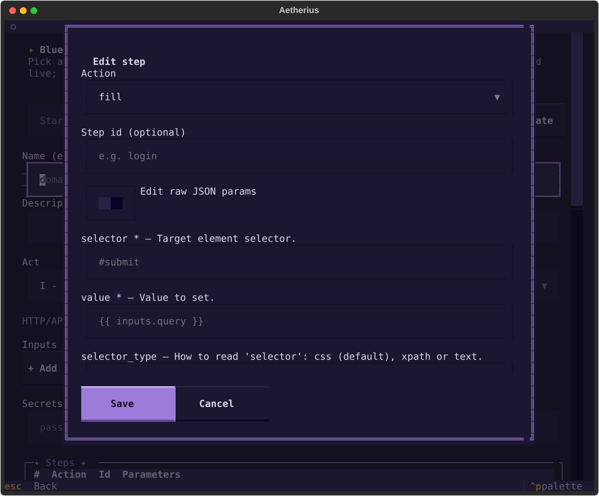
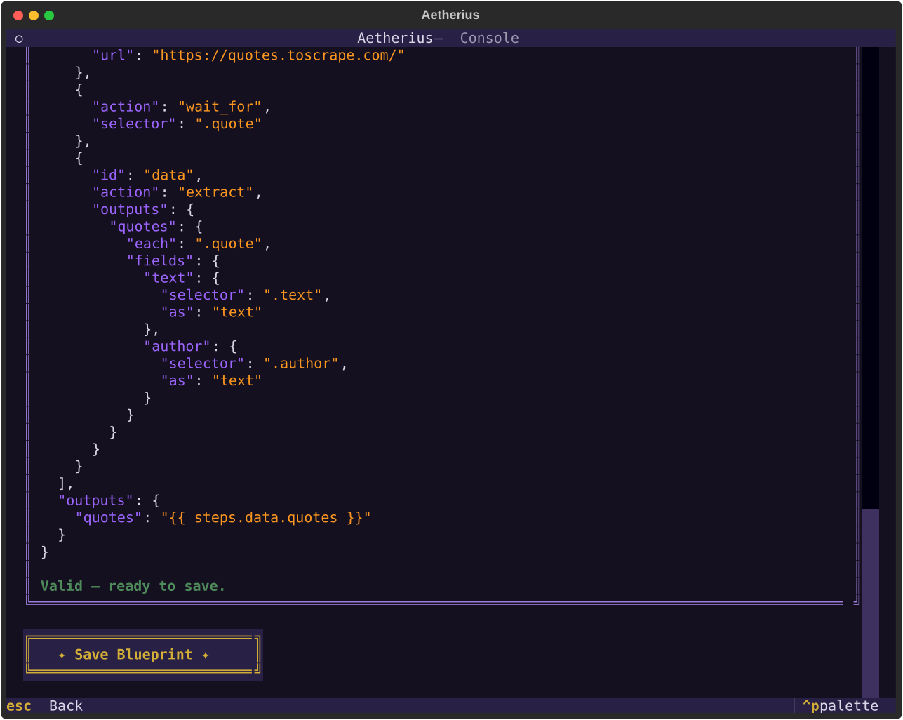

# Builder headless & Blueprint Studio

**Statut : implémenté et opérationnel.** Création **et édition** de Blueprints au plus haut niveau,
sans écrire de JSON — depuis la Console (Blueprint Studio) ou par programme (module
[`builder/`](../src/aetherius/builder/)). Cœur **pur** (sans Textual), couvert par la CI de base.

Trois voies de création coexistent (voir aussi le [README](../README.md)) : le **Recorder** (par
démonstration, voir [docs/recorder.md](recorder.md)), le **Blueprint Studio** (guidé, décrit ici) et
le **JSON à la main**. Elles se combinent : un Blueprint enregistré par le Recorder s'ouvre ensuite
dans le Studio pour être affiné.

## Architecture

Le module `builder/` est la construction **headless** de Blueprints ; la Console n'en est que
l'habillage. Le sens des dépendances est `console → builder → core` (jamais l'inverse) ; le recorder
consomme lui aussi le builder (`assemble_blueprint` y a migré).

- [`catalog.py`](../src/aetherius/builder/catalog.py) — projection UI du dictionnaire d'actions :
  `act_infos()`, `actions_for_act(act)`. Aucune métadonnée d'action n'est définie ici, seulement
  **croisée** (specs × capabilities × statut). C'est la matérialisation de l'invariant
  d'[architecture](architecture.md) : « le registre est l'unique source, le catalogue en est la
  projection ». L'écran Catalog de la Console le consomme (plus de descriptions dupliquées). Les
  actions **plugin** chargées (Jalon 1.5-E) sont projetées sous chaque Act avec leur spec, sans rien
  changer ici — voir [plugins.md](plugins.md).
- [`factory.py`](../src/aetherius/builder/factory.py) — `BlueprintDraft` (état d'édition mutable,
  **lossless**), `StepDraft`, `build_blueprint`, `save_blueprint`, plus `assemble_blueprint` /
  `slugify_name`.
- [`validation.py`](../src/aetherius/builder/validation.py) — `validate_draft(draft)` qui **ne lève
  jamais** et retourne une liste d'`ValidationIssue` (erreurs/avertissements) pour l'aperçu live.
- [`templates.py`](../src/aetherius/builder/templates.py) — starters garantis valides par test :
  `list_templates()`, `template_draft(key)`.

### Les specs d'actions : `core/actions/`

Le Studio génère ses formulaires à partir de specs **déclaratives** — une `ActionSpec` par action,
avec ses `ParamSpec` (nom, type, requis, aide, exemple). Elles vivent dans le cœur
([`core/actions/{navigation,interaction,data,flow}.py`](../src/aetherius/core/actions/)) et sont
agrégées par [`registry.py`](../src/aetherius/core/actions/registry.py) (`action_specs()`,
`get_spec(name)`). Deux tests **anti-drift** les gardent honnêtes :

- `tests/unit/core/actions/test_specs.py` : bijection stricte entre `action_specs()` et l'enum
  `Capability` (une spec par action, ni plus ni moins).
- `tests/unit/acts/test_action_dispatch.py` : pour chaque `(act, action)`, le driver **dispatche**
  réellement l'action — sauf si elle figure dans `PENDING_ACTIONS`. Ce test a d'ailleurs révélé deux
  écarts réels (voir ci-dessous).

### Actions déclarées mais pas encore exécutables (`PENDING_ACTIONS`)

Certaines actions figurent dans la table des capabilities mais ne sont **pas** dispatchées par le
driver de l'Act. Elles restent proposées (on peut légitimement rédiger pour plus tard) mais le Studio
les étiquette **« not runnable yet »** et l'aperçu remonte un avertissement.
[`core/actions/base.py::PENDING_ACTIONS`](../src/aetherius/core/actions/base.py) en est la source,
gardée par le test de dispatch :

- **Vector** : `extract` (l'extraction Vector est un *paramètre* de `http.request`, pas un step
  autonome).
- **Continuum** : `http.request` (hérité des capabilities de Vector mais non câblé dans le driver
  navigateur).

Les actions de flux `if`/`repeat`/`for_each` ne sont **plus** pending : elles sont interprétées par
le moteur (`core/runtime/steps.py`) pour tous les Acts, donc runnables partout où l'Act les déclare.
`notify` non plus (jalon 1.5-C livré) : le handler partagé la dispatche sur Vector et Continuum
(voir [docs/notifications.md](notifications.md)).

## API headless

```python
from aetherius.builder import BlueprintDraft, StepDraft, validate_draft, save_blueprint

draft = BlueprintDraft(name="api.users", act="vector")
draft.steps.append(StepDraft(action="http.request", id="fetch", params={
    "url": "https://jsonplaceholder.typicode.com/users",
    "expect": {"status": 200},
}))

issues = validate_draft(draft)          # [] quand tout est valide ; ne lève jamais
if not issues:
    path = save_blueprint(draft)        # ecrit ./blueprints/api.users.blueprint.json (re-valide)
```

- `validate_draft` enchaîne exactement les vérifications du runtime : schéma JSON, modèle Pydantic,
  puis règles sémantiques (action supportée par l'Act, paramètres requis, actions *pending*).
- `build_blueprint(draft)` finalise en `Blueprint` typé et **lève** (`BlueprintSchemaError` /
  `BlueprintValidationError`) — c'est le chemin strict.
- `save_blueprint(draft, path=…)` écrase un fichier existant (mode édition) ; sans `path`, il crée
  `./blueprints/{slug}.blueprint.json` et **refuse d'écraser** un autre Blueprint de même nom
  (`BuilderError`). Le fichier écrit est relu par le loader canonique — même garantie que le recorder.

## Le Blueprint Studio (Console)

`aetherius` → **Blueprint Studio**. Un écran unique scrollable, avec un **aperçu JSON validé en
direct** à mesure qu'on édite :

- **Template** (création) — partir d'un starter zéro-config (`vector.api-fetch`, `continuum.scrape`,
  `continuum.login`).
- **Name / Description**, **Act** (avec explication et statut runnable).
- **Inputs / Secrets** — inputs typés (nom, type, requis) rendant le Blueprint réutilisable ; secrets
  par nom (jamais de valeur stockée).
- **Steps** — table + boutons Add/Edit/Remove/↑/↓. L'édition d'un step ouvre un **formulaire par
  action** (champs pilotés par les specs) ; les paramètres objet/tableau (`extract.outputs`,
  `http.request.form`…) s'éditent en **JSON**, et une bascule **« raw JSON params »** rend n'importe
  quelle combinaison atteignable (complétude).
- **Options** durables — debug, timeout, retries, stealth (preset), session. (Contrairement au toggle
  Debug *ponctuel* de l'écran Runs, ce sont les options écrites dans le fichier.)
- **Vars / Outputs** — deux maps libres éditées en JSON.
- **Save** — écrit dans `./blueprints` (que la Library découvre) ou écrase le fichier édité.

### Éditer un Blueprint existant

Dans la **Library**, la touche **`e`** ouvre le Blueprint surligné dans le Studio, pré-rempli.
`BlueprintDraft` est **lossless** : ouvrir puis ré-enregistrer un fichier le reproduit à l'identique
(garanti par `tests/unit/builder/test_roundtrip_examples.py` sur **tous** les exemples). C'est le
flux « enregistrer une base au Recorder, puis affiner les détails au Studio ».

## Prise en main (Console)

`aetherius` → **Blueprint Studio**. L'écran assemble le Blueprint par formulaires, avec un **aperçu
JSON validé en direct** à droite du contenu.


1. **Partir d'un template.** En haut, choisir un starter (ex. *Scrape a page*) et cliquer **Load
   template** : le nom, l'Act, les steps et les options se remplissent d'un coup.
2. **Éditer un step.** Dans la table **Steps**, **+ Add** (ou **Edit** sur une ligne) ouvre un
   formulaire dont les champs sont pilotés par l'action choisie. Les paramètres objet/tableau
   s'éditent en JSON, et la bascule **« Edit raw JSON params »** donne le contrôle total.

   

3. **Suivre la validation en direct.** L'aperçu se met à jour à chaque frappe : erreurs en rouge,
   avertissements en orange (ex. action *not runnable yet*), ou un **« Valid — ready to save. »** vert
   quand le Blueprint est prêt. On ne peut pas sauvegarder un Blueprint invalide.

   

4. **Sauvegarder.** **✦ Save Blueprint ✦** écrit dans `./blueprints/<nom>.blueprint.json` (que la
   Library découvre) et notifie le chemin. Depuis la Library, **Entrée** lance le Blueprint (écran
   Runs), et la touche **`e`** le rouvre dans le Studio pour l'éditer.

> Les captures ci-dessus sont générées automatiquement (`make screenshots`) — voir
> [console.md](console.md) pour le reste de la Console.

## Limites connues

- **Flux conditionnel : édition en JSON.** `if` / `repeat` / `for_each` sont exécutés (jalon 1.5-B)
  et proposés par le catalogue, mais le Studio n'offre pas d'éditeur visuel des steps imbriqués :
  les branches `then`/`else`/`steps` s'écrivent comme paramètres JSON (préservées au round-trip).
  La validation du Studio ne descend pas dans les branches ; `aetherius validate` et le moteur, si.
- **Params imbriqués = JSON.** Les valeurs objet/tableau s'éditent en JSON (le schéma laisse ces
  sous-structures ouvertes) ; la bascule « raw JSON » couvre tout le reste.
- **Stealth fin.** Le sélecteur d'options couvre `off` + presets ; une configuration `stealth`
  détaillée (objet) s'écrit en éditant le JSON, et est **préservée** telle quelle en édition.
- **Édition d'un fichier `examples/`.** Ouvrir un exemple du dépôt en édition et sauvegarder l'écrase
  sur place (intention explicite) — travailler sur une copie sous `./blueprints` si besoin.
- **Pas de commande CLI dédiée** ce jalon : la Console et l'API headless suffisent ; `aetherius
  validate` couvre la vérification scriptable, et le daemon exposera le builder plus tard.

## Tester le Blueprint Studio

Cœur pur (CI de base) :

```bash
make test    # tests/unit/builder/, tests/unit/core/actions/, tests/unit/console/screens/builder/
```

À la main, le flux complet :

```bash
aetherius            # Home -> Blueprint Studio
# Charger le template "API fetch", renommer, Save -> notification avec le chemin.
# Library (touche r pour rescanner) -> l'entree "ready" -> Enter -> Runs -> Run reel (jsonplaceholder).

# Editer : enregistrer une base, puis l'affiner
aetherius record quotes.login --url https://quotes.toscrape.com/login
# Library -> surligner la ligne -> touche e -> le Studio s'ouvre pre-rempli -> ajuster -> Save.

# Verifier le fichier produit
aetherius validate blueprints/quotes.login.blueprint.json
aetherius run examples/vector/jsonplaceholder-posts-studio.blueprint.json
```
