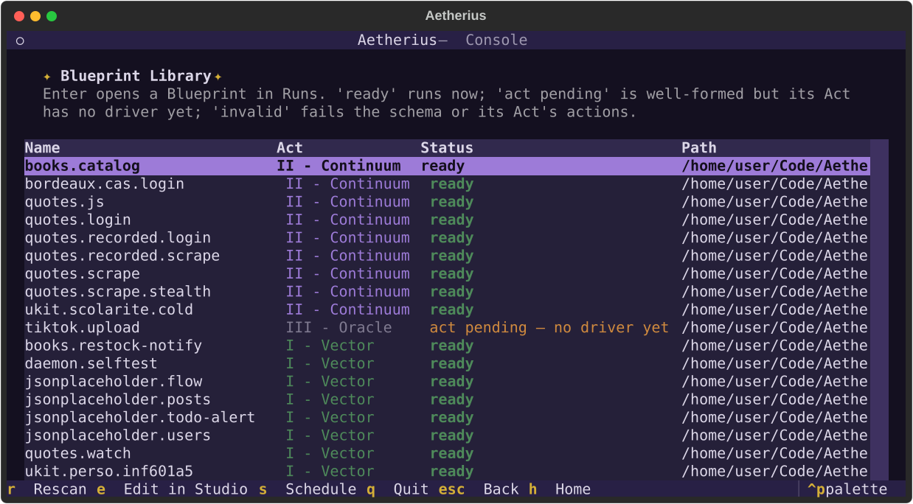
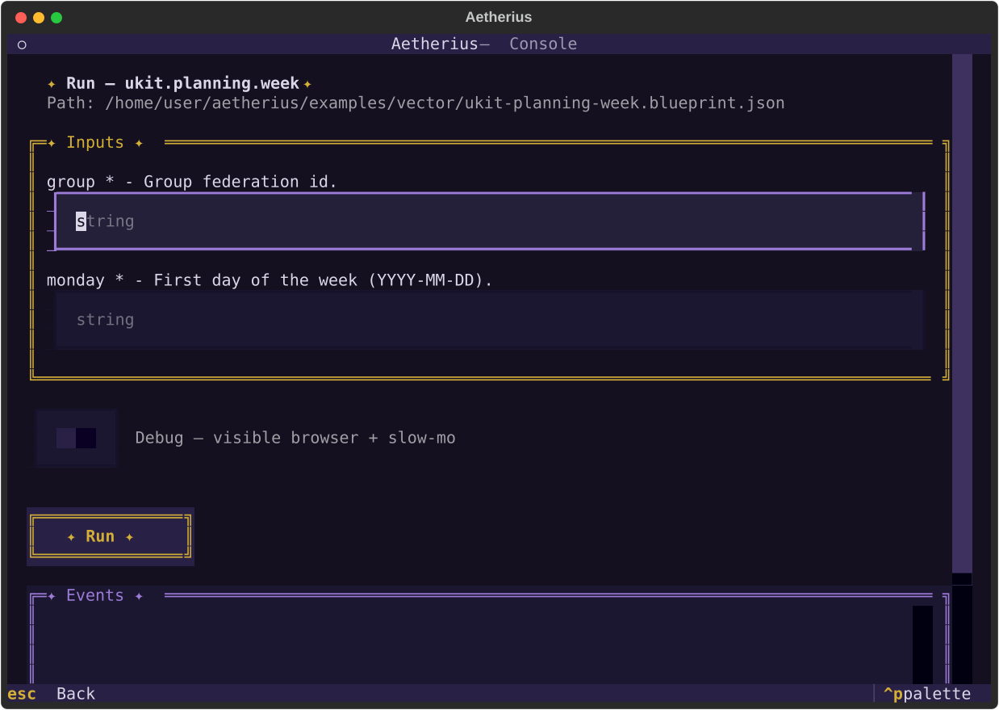
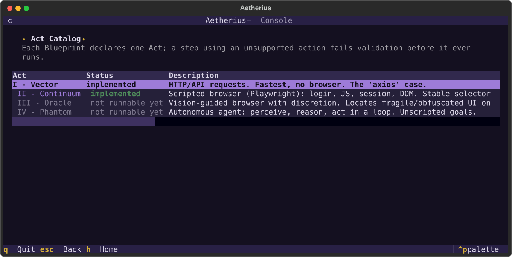
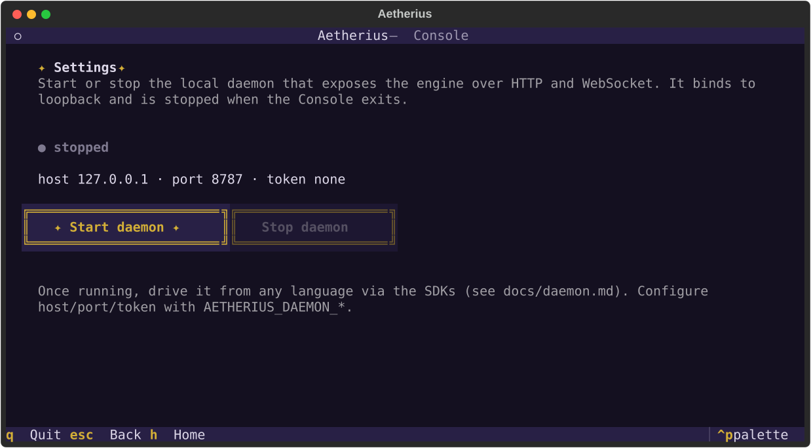

# Console (Textual)

Le centre de contrôle terminal (voir aussi le [README](../README.md)). `aetherius` ou
`aetherius console` ouvre l'app Textual [`console/app.py`](../src/aetherius/console/app.py) ;
`aetherius run|validate` sont les chemins scriptables non-interactifs
([`cli.py`](../src/aetherius/cli.py)).


## Plan des écrans

```
Home ─┬─ Library ──► Runs   (Library parcourt les Blueprints ; en ouvrir un mène à Runs :
      │         │            formulaire d'inputs/secrets, toggle Debug, exécution +
      │         └► Studio    événements en direct, résultat final ; la touche `e` ouvre
      │                       l'entrée surlignée dans le Blueprint Studio en édition)
      ├─ Catalog   (les 4 Acts, statut d'implémentation, capabilities par Act)
      ├─ Recorder  (capture un Blueprint par démonstration — voir docs/recorder.md)
      ├─ Builder   (Blueprint Studio : créer et éditer un Blueprint, guidé — voir docs/builder.md)
      ├─ Settings  (démarrer/arrêter le daemon local, voir son statut et sa config)
      └─ Sessions  (en attente : stealth/session)
```

Runs n'est **pas** une entrée du menu Home : c'est la vue de détail d'un Blueprint (pattern
maître-détail), atteinte en sélectionnant une ligne dans Library. Un **toggle Debug** y permet de
choisir au moment du run une fenêtre visible + slow-mo (équivalent de `aetherius run --debug`) sans
modifier le fichier — les options durables (`debug`, `stealth`, `session`, …) se règlent, elles, dans
le **Blueprint Studio** ([docs/builder.md](builder.md)). L'écran **Catalog** est désormais une pure
projection du catalogue partagé du builder (`builder/catalog.py`) : les descriptions d'Act et le
statut runnable/pending y sont la même source que dans le Studio.

`core/runtime/engine.py::IMPLEMENTED_ACTS` est la seule source de vérité pour « quel Act est
exécutable » — Home, Catalog et Runs la lisent tous ; ne jamais dupliquer cette liste. Vector
(Act I) et Continuum (Act II) y figurent : Runs exécute donc aussi les Blueprints `continuum`
lorsque l'extra `[browser]` est installé. Sans lui, le run échoue proprement sur une
`DependencyError` (message + commande d'installation) affichée en notification, l'écran restant
navigable.

Library reflète cet état réel via [`library_scan.py::entry_status`](../src/aetherius/console/screens/library_scan.py) :
**ready** (schéma valide et Act runnable), **act pending** (bien formé mais Act sans driver, ex.
Oracle) ou **invalid** (erreur de schéma ou d'action). Les badges d'Act suivent la même logique
(`theme.act_color`) : un Act runnable porte sa couleur, un Act en attente reste gris — dérivé de
`IMPLEMENTED_ACTS`, donc jamais à re-maintenir à la main. Côté Runs, un secret déjà présent dans
`.env` s'affiche « loaded from .env » et peut être laissé vide (voir [docs/secrets.md](secrets.md)).

## Les écrans en images

Toutes les captures ci-dessous sont générées automatiquement par `make screenshots` (voir la fin de
ce document) — elles restent donc fidèles à l'UI réelle.

**Library** — parcourir les Blueprints découverts, avec leur statut (`ready` / `act pending` /
`invalid`). `Entrée` ouvre dans Runs, `e` ouvre dans le Blueprint Studio, `r` rescanne.



**Runs** — la vue de détail d'un Blueprint : formulaire d'inputs/secrets, toggle Debug, bouton Run,
puis événements en direct et résultat final.



**Catalog** — la référence des 4 Acts : statut d'implémentation et actions supportées (un `†` marque
une action déclarée mais pas encore exécutée par le driver de l'Act).



**Settings** — démarre et arrête le daemon local (`aetherius serve`) sans quitter le terminal, et
affiche son statut (arrêté / en marche + `healthy`), son adresse de bind et son état d'auth. Le daemon
est **lié à la session** : il survit à la navigation mais s'arrête à la fermeture de la Console (pour
un daemon persistant, lancer `aetherius serve` dans un terminal). Le contrôle du sous-process vit dans
[`console/daemon_control.py`](../src/aetherius/console/daemon_control.py) (un `DaemonController`
possédé par l'App, une instance par session, avec garde `atexit` contre les orphelins) ; la sonde de
santé tourne dans un worker `@work(thread=True)`. Détails du daemon : [docs/daemon.md](daemon.md).



Le **Blueprint Studio** et le **Recorder** ont leur propre prise en main illustrée dans
[docs/builder.md](builder.md) et [docs/recorder.md](recorder.md).

Le seul écran encore en attente (`console/screens/sessions.py`) s'appuie sur la base commune
[`console/screens/_pending.py`](../src/aetherius/console/screens/_pending.py) : il affiche ce que
l'écran fera et le jalon dont il dépend, sans fausse interactivité. Le **Recorder**
([`recorder.py`](../src/aetherius/console/screens/recorder.py)) et le **Blueprint Studio**
([`screens/builder/`](../src/aetherius/console/screens/builder/)) sont, eux, pleinement interactifs.
Le Recorder pilote le blueprint recorder dans un worker `@work(thread=True)` et streame les actions
capturées via le pattern Sink ci-dessous ; détails dans [docs/recorder.md](recorder.md). Le Studio,
lui, ne fait que du travail local (assemblage + validation en mémoire) : aucun worker, l'écran
possède un unique `BlueprintDraft` que ses éditeurs enfants alimentent ; voir
[docs/builder.md](builder.md).

## Streamer les événements d'un run : le pattern Sink

`RunEngine.run()` est synchrone et bloquant ; la Console le pilote depuis un worker Textual
(`@work(thread=True)`, voir [`console/screens/runs.py`](../src/aetherius/console/screens/runs.py)).
[`console/run_bridge.py`](../src/aetherius/console/run_bridge.py) fournit `TextualRunSink`, un
`Sink` (voir [`core/events/sinks.py`](../src/aetherius/core/events/sinks.py)) qui relaie chaque
`RunEvent` vers un widget via `App.call_from_thread` — le mécanisme Textual pour franchir la
frontière thread-worker → thread-UI. Ne lève jamais.

Tout futur écran qui doit streamer des événements d'un run (Act II+, daemon) doit réutiliser ce
même pattern plutôt que d'en inventer un nouveau.

## Widgets réutilisables

- [`widgets/event_log.py`](../src/aetherius/console/widgets/event_log.py) — `EventLog(RichLog)`,
  flux d'événements coloré par niveau.
- [`widgets/form.py`](../src/aetherius/console/widgets/form.py) — `BlueprintInputForm`, formulaire
  généré depuis `Blueprint.inputs`/`secrets`.
- [`widgets/json_preview.py`](../src/aetherius/console/widgets/json_preview.py) — `JsonPreview`,
  rendu JSON coloré (Rich `Syntax`).
- [`widgets/run_summary.py`](../src/aetherius/console/widgets/run_summary.py) — `RunSummary`,
  résultat final d'un run (statut, étapes, outputs). Masqué tant qu'aucun résultat n'est arrivé,
  révélé puis scrollé en vue à la fin du run.

## Thème et direction artistique

[`console/theme.py`](../src/aetherius/console/theme.py) est la source unique de la DA :
« éther nocturne » — antiquité mystique sombre, adaptée au terminal (un fond clair y rend mal ;
décision verrouillée par un test). Dominantes : violet crépusculaire (structure), pourpre tyrien
(le mystique, le « pas encore révélé »), vert laurier foncé (succès, lierre) ; le texte reste
clair de lune pour la lisibilité et l'or impérial est réservé aux étoiles et au wordmark.
Ornements : frises mosaïque `▚▞` (`frieze()` horizontal, `frieze_column()` vertical — colonnes
des écrans en attente), étoiles `✦` (`starred()` pour les titres, marqueurs du menu Home,
bouton Run), guirlande de lierre `❧─❦─❧` (`garland()` — le *hedera*, la feuille de lierre des
inscriptions romaines). Wordmark AETHERIVS généré avec pyfiglet (police `ansi_shadow`,
outil de dev uniquement, résultat figé — jamais de dépendance runtime ; alignement gardé par un
test). Toute couleur affichée par un écran vient de ce module (jamais de couleur en dur ailleurs).

Répartition des styles : la mise en page propre à un widget réutilisable vit dans son
`DEFAULT_CSS` (scopé) ; [`console/console.tcss`](../src/aetherius/console/console.tcss) ne
contient que le layout au niveau écran. Règle d'ergonomie : les conteneurs de contenu utilisent
`height: auto` + corps d'écran en `VerticalScroll`, pour que rien ne soit compressé ni perdu
dans un terminal bas (les champs de formulaire gardent leur hauteur, l'écran scrolle).

## Captures d'écran de la doc

Les captures des écrans (`docs/screenshots/*.svg`) sont **générées**, jamais prises à la main :
[`console/screenshots.py`](../src/aetherius/console/screenshots.py) pilote l'app en headless
(`run_test`/`Pilot`, comme les tests), exporte chaque écran en SVG et le **normalise** (identifiant
Rich stabilisé, `@font-face` externe strippé, chemin du dépôt neutralisé) — d'où des fichiers
déterministes et sans fuite de chemin local.

```bash
make screenshots         # régénère docs/screenshots/ après toute évolution de l'UI
make screenshots-check   # échoue si les captures committées sont périmées (garde-fou CI)
```

C'est la **source unique** des captures : ajouter un écran ou changer un layout ⇒ ajouter/ajuster
un scénario dans `screenshots.py` puis `make screenshots`. Le test
[`tests/unit/console/test_screenshots.py`](../tests/unit/console/test_screenshots.py) rejoue la
génération (donc rend chaque écran) et vérifie SVG valide + déterminisme.
