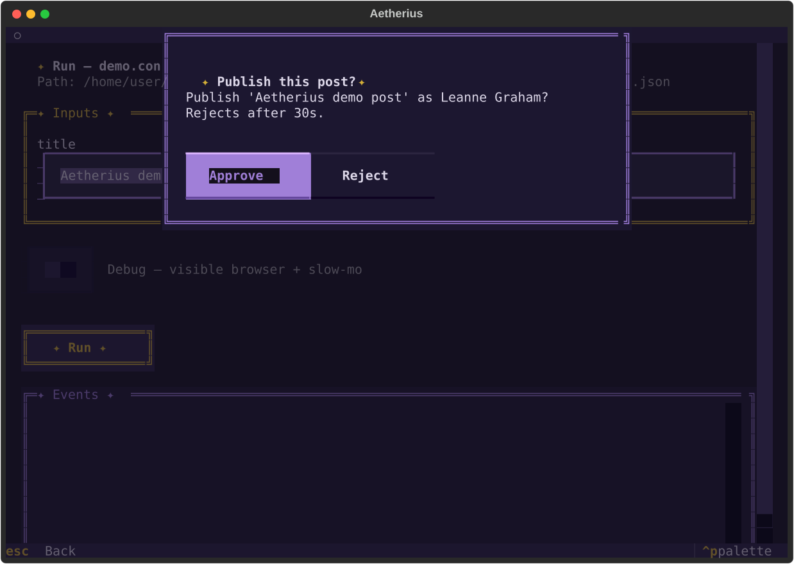

# Human-in-the-loop — l'action `confirm`

Jalon 2-E. Une action **orthogonale aux Acts** qui **gare le run** jusqu'à une décision humaine
(approuver / rejeter, ou fournir une valeur), avec un **timeout obligatoire**. Elle rend le bot
pilotable **à distance** (surveillance restock → « confirmer l'achat ? ») **et** en local (comme les
permissions de Claude Code).

## Le modèle : attente bloquante, pas suspend/resume

Un `confirm` **bloque le worker-thread** du run sur un rendez-vous (`threading.Event`) exactement
comme `wait` bloque sur `time.sleep` — sauf qu'ici c'est une décision, pas une durée, qui le réveille.
Le run, **son navigateur compris**, reste **vivant et garé** : pas de sérialisation d'état, pas de
reprise après redémarrage (irréaliste avec une page Playwright vivante). Le **statut du run reste
`running`** pendant l'attente — aucun nouveau statut, modèle honnête. Le timeout garantit qu'un run
garé finit **toujours** par être libéré.

Le worker bloque, **jamais la boucle** : un run tourne sur `asyncio.to_thread` (daemon), un worker
Textual (Console) ou le thread principal (`aetherius run`). La décision arrive sur une autre surface
et signale l'`Event` — thread-safe par construction, sans passer par `call_soon_threadsafe` (la
simplification par rapport au pont `QueueSink`, dont le hop existe parce qu'un widget Textual, lui,
n'est pas thread-safe).

## Le step `confirm`

```json
{
  "id": "approve",
  "action": "confirm",
  "title": "Publier ce post ?",
  "message": "Publier '{{ inputs.title }}' comme {{ steps.preview.author | first }} ?",
  "timeout_ms": 30000,
  "on_timeout": "reject",
  "channel": "ntfy",
  "target": "{{ secrets.ntfy_topic }}"
}
```

| Champ | Rôle |
|-------|------|
| `message` (requis) | Ce que l'humain est invité à approuver. |
| `title` | Titre court de la demande. |
| `timeout_ms` | Borne d'attente (défaut **300000**, 5 min). Un run ne gare jamais éternellement. |
| `on_timeout` | À l'expiration : `approve`, `reject` (défaut), ou `fail:CODE`. |
| `channel` / `target` / `config` / `level` | Canal de notification optionnel pour **alerter** qu'une décision est en attente (mêmes champs que `notify`). |

**Sorties** : `{{ steps.<id>.approved }}` (booléen), `decision` (`approved`/`rejected`), `value`
(valeur fournie, le cas échéant), `decided_by` (la surface : `console`/`api`/`cli`/`notification`/
`timeout`). Le motif idiomatique est de **garder** le step sensible par le résultat :

```json
{ "id": "publish", "when": "{{ steps.approve.approved }}", "action": "http.request", "...": "..." }
```

Un step gardé dont la garde est fausse est **sauté** (statut `skipped`). Pour référencer sa sortie
dans `outputs` sans casser quand il est sauté, garder l'accès :
`{{ steps.publish.post_id if steps.publish is defined else None }}`.

### `on_timeout` — deny-by-default

Le défaut est **`reject`** : sans réponse, le step renvoie `{approved: false}` et **le run continue**
— le step sensible gardé par `when` se saute simplement. C'est le choix prudent pour une action
sensible (ne rien faire sans accord explicite), et le plus composable. `fail:CODE` offre la sémantique
d'**arrêt dur** (le run échoue proprement avec le code, comme `wait_for`) ; `approve` est optimiste, à
réserver aux confirmations non critiques.

### Run non surveillé (bibliothèque)

Un `client.run(...)` in-process **sans surface** (aucune gateway branchée) est *non surveillé* :
`confirm` applique son `on_timeout` **immédiatement**, sans jamais garer. Les runs bibliothèque
restent donc non interactifs et sûrs par défaut. Les surfaces (Console, CLI, daemon) branchent une
gateway et le run se gare réellement.

## Les surfaces de décision — un rendez-vous, plusieurs voies

| Surface | Comment on décide |
|---------|-------------------|
| **Console** | Un `ConfirmModal` s'ouvre sur l'événement `input_requested` ; Approve/Reject résout le rendez-vous. |
| **CLI / in-process** | `aetherius run` invite sur stdin (`questionary`), sur un thread pour respecter le timeout ; sans TTY, la demande retombe sur son `on_timeout`. |
| **API daemon** | `POST /v1/runs/{id}/decisions` avec le `token` porté par l'événement `input_requested`. |
| **Réponse de notification** | Boutons **Approve/Reject** d'une notification **ntfy** qui POSTent la route de décision (voir plus bas). |
| **Application mobile** | Un **modal natif** (`<AetheriusConfirm />`), sur le moteur embarqué — jalon 3-E. Là où il a fallu quatre surfaces ici, un téléphone n'en a qu'une, et elle est évidente. Même sémantique : run garé, statut inchangé, délai obligatoire, refus par défaut. Voir [docs/embedded.md](embedded.md#confirm-en-modal-natif). |



### Événements

Deux nouveaux `EventType` (contrat `contracts/events.schema.json`) : `input_requested` (le run est
garé — porte le `token`, le `title`, le `timeout_ms`) et `input_provided` (la décision, ou le timeout,
qui l'a repris — porte `approved`, `decided_by`). Le statut du run ne change pas.

### API daemon

```
POST /v1/runs/{id}/decisions   { "token": "<opaque>", "approved": true }
  200  { "run_id": "...", "accepted": true }   décision livrée au run garé
  404  run inconnu
  409  aucune décision en attente, ou token invalide
```

Le `token` est **opaque, lié au `run_id`**, minté par le step et porté par l'événement
`input_requested`. Il est l'autorisation : un token stale ou forgé ne résout rien. La route garde le
même modèle **loopback + bearer** que le reste de l'API.

### Réponse de notification (ntfy)

Quand `confirm` nomme un `channel` **et** que le daemon connaît une URL publique
(`AETHERIUS_DAEMON_PUBLIC_URL`, typiquement derrière un reverse proxy TLS), la notification ntfy porte
deux boutons d'action **Approve** / **Reject** qui POSTent `/v1/runs/{id}/decisions` avec le token (et
le bearer du daemon). Approuver depuis le téléphone, sans app à construire. Sans URL publique
joignable (le défaut loopback), l'alerte reste **informative** — pas de bouton mort. Détails du
transport : [docs/notifications.md](notifications.md).

> **Callback Telegram** : une évolution future (un bot recevant les callbacks). ntfy couvre le cas
> « alerte-moi sur mon téléphone → un tap » sans infrastructure supplémentaire.

## Persistance / observabilité

Chaque demande est tracée dans une petite table `approvals` du store (migration forward-only
v1→v2) : `pending` à la levée, puis `approved`/`rejected`/`timeout` à la résolution. Le daemon écrit
cette piste d'audit **depuis le flux d'événements** (source unique, sans course). C'est de
l'observabilité : le rendez-vous vivant, lui, est en mémoire — un run garé ne survit pas à son worker,
il n'y a donc rien à reprendre après un redémarrage.

## Sécurité

- Token opaque (`secrets.token_urlsafe`) lié au `run_id` ; un token inconnu est rejeté proprement
  (409).
- La route daemon reste **loopback + bearer** par défaut ; l'exposer exige un reverse proxy TLS et un
  token (mêmes règles que le reste de l'API — [docs/deployment.md](deployment.md)).
- Les adresses de canal (topic ntfy, chat id) restent des `{{ secrets.x }}`, jamais stockées.

## Exemple exécutable

[`examples/vector/confirm-before-post.blueprint.json`](../examples/vector/confirm-before-post.blueprint.json)
(zéro configuration) : un GET public, puis `confirm` (timeout court, `on_timeout: reject`), puis un
POST « sensible » gardé par `when: {{ steps.approve.approved }}`. Lançable depuis `aetherius run`
comme depuis la Console.

## Tester

- **Console** : `aetherius` → Library → lancer `confirm-before-post`. Le modal s'ouvre, le run reste
  `running` ; Approve → le POST s'exécute ; relancer, Reject → il se saute ; relancer, laisser filer
  le timeout court → `reject` appliqué.
- **CLI** : `aetherius run examples/vector/confirm-before-post.blueprint.json` → l'invite stdin gare
  le run ; répondre le reprend ; sans réponse (ou sans TTY) → timeout → `reject`.
- **API daemon** : `aetherius serve` (token) → `POST /v1/runs` du Blueprint → observer
  `input_requested` sur `WS /v1/runs/{id}/events` → `POST /v1/runs/{id}/decisions` le reprend ; token
  inconnu → 409, run inconnu → 404.
- **Notification** : `AETHERIUS_DAEMON_PUBLIC_URL` défini → un `confirm` avec `channel: ntfy` pousse
  une notification avec boutons **Approve/Reject** ; taper résout le run garé.

### Sondes réalistes (résultats consignés)

- **Timeout sous charge** : un `confirm` à timeout court pendant un run occupé se libère bien à
  l'échéance (le worker se réveille sur `Event.wait` expiré), `reject` appliqué. ✔
- **Deux runs garés en parallèle** : chacun a son rendez-vous par `run_id` ; décidés indépendamment,
  aucune fuite de décision d'un run à l'autre. ✔
- **Décision après la fin du run** : un POST de décision arrivé après que le run a fini renvoie **409**
  (rien en attente), sans crash ni double-application. ✔ (« premier arrivé gagne » côté rendez-vous.)
- **Act navigateur garé** : un `confirm` au milieu d'une session Continuum garde la page **vivante** ;
  la reprise poursuit sur la même session. ✔
